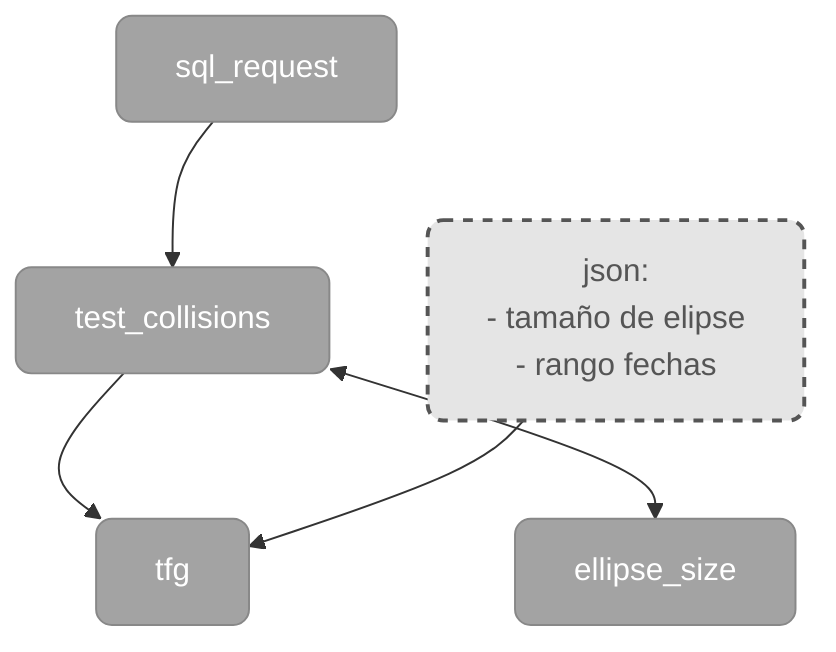

# Detección y Representación de Navegaciones Agresivas en Buques

## Descripción
Este repositorio contiene el código de software desarrollado para el Trabajo Fin de Grado (TFG) titulado "Herramienta de geometría variable para la detección y representación de navegaciones agresivas en buques".
El proyecto implementa un modelo matemático dinámico basado en una elipse de seguridad de geometría variable para mejorar la evaluación del riesgo en la navegación marítima. A partir del procesamiento masivo de datos AIS, la herramienta identifica encuentros peligrosos en los que un buque invade el área de seguridad de otro.

## Estructura del Proyecto
* **`main.py`**: script de ejecución principal que coordina la carga de configuración, la consulta a la base de datos y el cálculo de colisiones.
* **`config.json`**: archivo de configuración con parámetros como rango de tiempo, factor de elipse y velocidad mínima.
* **`ellipse_size.py`**: módulo matemático que calcula las dimensiones y orientación de la elipse de seguridad en función de la cinemática del buque.
* **`sql_request.py`**: encargado de establecer la conexión con MySQL y extraer los datos AIS mediante ventanas temporales.
* **`test_collisions.py`**: ejecuta las operaciones matriciales para comprobar si los centros de las elipses de los buques intersecan entre sí y exporta los resultados.
* **`map.py`**: interfaz gráfica desarrollada con Tkinter para representar cartográficamente los encuentros detectados en el mapa.

## Arquitectura del Software

Para una mejor comprensión gráfica, el siguiente diagrama muestra el flujo de ejecución e interacción entre los distintos módulos del programa:

## Arquitectura del Software

Para su comprensión gráfica se ha elaborado el siguiente diagrama:

## Arquitectura del Software

Para su comprensión gráfica se ha elaborado el siguiente diagrama:



## Flujo de trabajo
1. **Configuración**: Modificar los parámetros deseados (fechas, velocidad, rango temporal) en el archivo `config.json`.
2. **Cálculo de colisiones**: Ejecutar `main.py` para extraer los datos de la base de datos y procesar matemáticamente las elipses. 
   
   Al ejecutarse el programa de forma continuada, los resultados se almacenarán de forma ordenada generando automáticamente la siguiente jerarquía de carpetas:

```text
   Datos de encuentros/         # Directorio raíz de resultados generados
   ├── 1/                       # Carpetas según el parámetro de iteración (ej. velocidad mínima)
   ├── 2/
   ├── ...
   └── 10/
       ├── 2018-01/             # Subcarpetas agrupadas por Año-Mes de los datos
       ├── 2018-02/
       ├── ...
       └── 2020-12/
           ├── 2020-11-30_23-45-00_2020-12-01_00-15-00_15.txt  # Archivos con los encuentros detectados
           ├── 2020-11-30_23-45-00_2020-12-01_00-45-00_15.txt  # (El nombre indica las ventanas de tiempo)
           ├── 2020-11-30_23-45-00_2020-12-01_01-15-00_15.txt
           └── 2020-11-30_23-45-00_2020-12-01_01-45-00_15.txt
```

## Autores
* **Pablo Manuel Martín Isabel**
